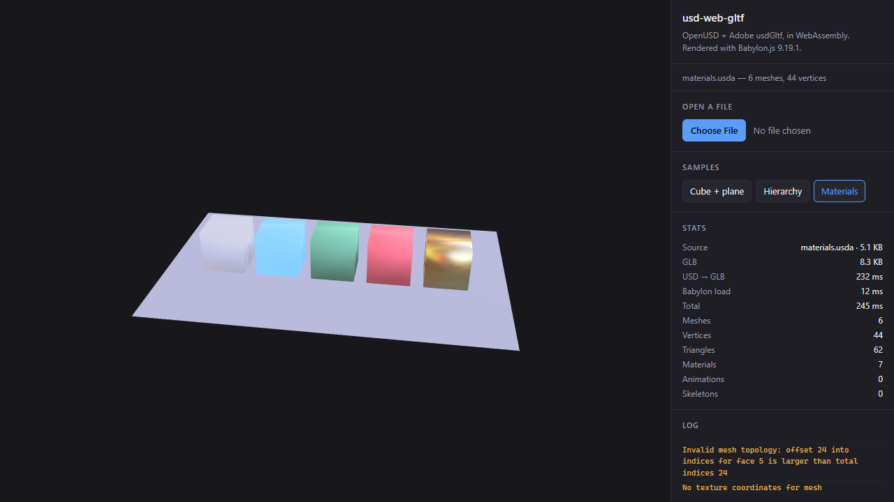

# usd-web

**OpenUSD and Adobe's `usdGltf` plugin, compiled to WebAssembly.** Converts USD
(`.usd`, `.usda`, `.usdc`, `.usdz`) to glTF/GLB entirely in the browser, so the result can
be handed to any glTF-capable renderer — Babylon.js, three.js, `<model-viewer>`.

```ts
import { usdToGlb } from "usd-web-gltf";

const glb = await usdToGlb(await file.arrayBuffer(), { fileName: file.name });
```

**[▶ Live demo](https://sergiorzmasson.github.io/usd-web/)** — drop in a USD file and see
it rendered.



---

## Why this exists

USD is the interchange format the industry is standardising on, but it is not a web format:
the spec is enormous and most of it has no meaning in a browser. glTF is the web format, and
Adobe already maintain a high-quality USD→glTF translator in
[USD-Fileformat-plugins](https://github.com/adobe/USD-Fileformat-plugins).

This project makes that translator run in the browser. It does **not** reimplement the
conversion — it compiles Adobe's plugin as a real USD file format plugin and lets OpenUSD
dispatch to it, exactly as a desktop USD installation would.

### The key finding: USD plugins work in WebAssembly

They are linked *statically* rather than loaded at runtime, and three things must line up:

1. **Plugins become static libraries.** `pxr_plugin` switches to
   `pxr_library(TYPE STATIC)` when `EMSCRIPTEN` is set
   (`cmake/macros/Public.cmake`), with the comment *"Dynamic linking is not supported yet
   in the usd build toolchain"*.
2. **`LibraryPath` is empty.** In the plugin's `plugInfo.json` the field is `""`, telling
   `PlugRegistry` the code is already in the process image. Registration happens through
   static initialisers instead of `dlopen`.
3. **Everything is whole-archived.** Nothing references those initialisers symbolically, so
   without `--whole-archive` the linker discards them. This applies to the plugin *and* to
   `libusd_m.a`, which contains `plug/initConfig.cpp` — the translation unit that installs
   USD's default plugin search paths. Omit it and you get `No plugin search paths` and a
   stage that will not open.

Verified at runtime:

```
OpenUSD version : 0.26.8
Output formats  : glb,gltf,usd,usda,usdc,usdz
glTF plugin     : REGISTERED
```

## Size

Release build, OpenUSD 26.08, no imaging, no Python, single-threaded:

| Artifact | Raw | gzip | brotli |
|---|---:|---:|---:|
| `usd-web-gltf.wasm` | 12.00 MB | 3.02 MB | 1.87 MB |
| `usd-web-gltf.data` (USD schemas & plugin manifests) | 0.79 MB | 0.14 MB | 0.10 MB |
| `usd-web-gltf.js` (Emscripten glue) | 0.13 MB | 0.03 MB | 0.03 MB |
| **Total** | **12.92 MB** | **3.19 MB** | **2.00 MB** |

For reference, USD core alone — able to open a stage and read geometry, but with no glTF
plugin — measures 10.86 MB raw / 1.62 MB brotli. **Adobe's entire importer *and* exporter
therefore costs about 1.9 MB raw, 0.4 MB brotli.** OpenUSD itself is the cost; the
converter is nearly free.

**Serve the `.wasm` with brotli.** It is the difference between 12 MB and 1.9 MB on the wire.

## No special headers required

The shipped module is **single-threaded**, so it needs no `SharedArrayBuffer` and therefore
no cross-origin isolation. It runs from any static host, including GitHub Pages.

A pthreads build also exists (oneTBB with threading enabled) for throughput on large scenes.
Using it requires the page to be cross-origin isolated:

```
Cross-Origin-Opener-Policy: same-origin
Cross-Origin-Embedder-Policy: require-corp
```

Conversion is CPU-bound and synchronous once it starts, so run it in a Web Worker if the
main thread must stay responsive.

---

## Building the WebAssembly

### Requirements

- **Emscripten 6.x** (`emcc`) — [installation](https://emscripten.org/docs/getting_started/downloads.html)
- **CMake 3.24+**, **Ninja**, **Git**, **Node 18+**
- A checkout of [adobe/USD-Fileformat-plugins](https://github.com/adobe/USD-Fileformat-plugins)

### One command

```powershell
./scripts/build.ps1 -AdobePluginsDir E:/Github/USD-Fileformat-plugins
```

This fetches and builds every dependency in order, skipping any step whose output already
exists:

1. **oneTBB** → static wasm library (required by OpenUSD)
2. **OpenUSD 26.08** → monolithic static wasm library, no imaging, no Python
3. **tinygltf** → header-only, pinned to the version Adobe's plugin expects
4. **this project** → the wasm module and its resource bundle

A cold build takes roughly **30–60 minutes**, nearly all of it OpenUSD.

Then the npm package and the demo:

```powershell
cd js;   npm install; npm run build
cd ../demo; npm install; npm run build   # writes ../docs
```

### Pinned versions, and why

| Dependency | Version | Reason |
|---|---|---|
| OpenUSD | **26.08** | First release that builds `pxr/usd` for Emscripten. 25.11 and earlier wrap `add_subdirectory(usd)` in `if (NOT EMSCRIPTEN)`, yielding only `pxr/base` — enough to link, not enough to open a stage. |
| tinygltf | **2.8.21** | Matches the `WriteImageDataFunction` signature Adobe's `gltf.cpp` uses. 2.9.x inserted an `FsCallbacks` parameter and fails to compile. |
| oneTBB | 2022.2.0 | Required by OpenUSD; builds for wasm out of the box. |

> **vcpkg's `usd` port cannot be used.** Its portfile declares
> `vcpkg_check_linkage(ONLY_DYNAMIC_LIBRARY)`, and wasm requires `BUILD_SHARED_LIBS=OFF`.

### What had to be replaced, and why

Adobe's `fileformatUtils` depends on **OpenImageIO** and **`pxr/imaging/hio`**. Neither is
viable here: OpenImageIO pulls in libtiff, libjpeg, OpenEXR and Boost, and `hio` only exists
when `PXR_BUILD_IMAGING=ON`, which would drag Hydra and OpenSubdiv into a binary that never
renders anything.

Both dependencies are confined to a single file, `utils/src/images.cpp` (39 references; the
glTF plugin itself has none). [`src/imagesWasm.cpp`](src/imagesWasm.cpp) reimplements that
file's public interface on top of **stb**, preserving the semantics that matter:

- pixels stay normalised floats with straight (unassociated) alpha, as OIIO produced;
- `stbi_ldr_to_hdr_gamma(1.0)`/`_scale(1.0)` make an 8-bit source decode to a plain
  `value / 255`, matching OIIO's `UINT8 → FLOAT` conversion rather than stb's default gamma
  curve;
- the same overflow-checked dimension validation and `TF_WARN` diagnostics are kept.

**The one functional trade-off:** stb decodes png/jpg/bmp/tga/gif/psd/hdr/pnm and encodes
png/jpg/bmp/tga. TIFF and EXR textures are rejected with a clear warning instead of silently
producing wrong pixels. Since glTF has no core HDR texture format, every texture this
pipeline emits is PNG or JPEG regardless.

**Everything else is upstream Adobe code, compiled unmodified.** The Adobe checkout is never
patched — only two things are supplied locally: build rules that produce static libraries
(upstream builds shared, which Emscripten cannot link), and the `images.cpp` replacement.

---

## Consuming it from JavaScript

### Install

The package lives in [`js/`](js). Until it is published to npm, install from a checkout:

```powershell
npm install /path/to/usd-web/js
```

Three files ship together and must stay side by side: `usd-web-gltf.js` (glue),
`usd-web-gltf.wasm`, and `usd-web-gltf.data` (USD's schemas and plugin manifests — the
converter cannot open a stage without it).

### One-liner

```ts
import { usdToGlb } from "usd-web-gltf";

const glb = await usdToGlb(bytes, { fileName: "chair.usdz" });
```

### Reusing the module

Instantiation loads a ~12 MB binary and dominates the cost of a conversion, so create one
converter and keep it:

```ts
import { UsdConverter } from "usd-web-gltf";

const converter = await UsdConverter.create();
console.log(converter.info);
// { usdVersion: "0.26.8", supportedOutputFormats: [...],
//   gltfPluginAvailable: true, resolver: "WebResolver" }

for (const asset of assets) {
    const { data, durationMs, missingAssets } = await converter.convert(asset.bytes, {
        fileName: asset.name,
        onLog: (m) => m.level !== "info" && console.warn(m.message),
    });
    if (missingAssets.length) {
        console.warn("Referenced but never supplied:", missingAssets);
    }
}
```

Conversions are serialised internally — the native module keeps global state, so overlapping
calls queue rather than corrupt each other.

### Hosting the artifacts elsewhere

```ts
const converter = await UsdConverter.create({
    wasmUrl: "https://cdn.example.com/usd/usd-web-gltf.js",
    // .wasm and .data are resolved next to the glue unless overridden
});
```

### Rendering with Babylon.js

```ts
import { AppendSceneAsync } from "@babylonjs/core/Loading/sceneLoader.js";
import "@babylonjs/loaders/glTF/index.js";
import { usdToGlb } from "usd-web-gltf";

const glb = await usdToGlb(bytes, { fileName: "chair.usdz" });

// Babylon accepts an ArrayBufferView directly — no blob URL needed. pluginExtension tells
// it which loader to use, since there is no filename to infer from.
await AppendSceneAsync(glb, scene, { pluginExtension: ".glb" });
```

A `usd-web-gltf/babylon` entry point wraps this, and
[`demo/babylon-loader-test`](demo/babylon-loader-test) exercises the loader that ships
inside Babylon.js itself.

> **Lighting matters.** USD→glTF produces PBR materials. Without an environment texture,
> metals render black. Give the scene an IBL.

---

## Asset resolution

USD resolves references through `ArResolver`. In a browser there is no filesystem, so
everything is served from Emscripten's in-memory FS, and references fall into two very
different cases.

**Relative references — `@parts/robot.usda@`.** These resolve against the directory of the
referencing layer. They work as soon as the sibling files are supplied:

```ts
await converter.convert(rootLayerBytes, {
    fileName: "scene.usd",
    additionalFiles: {
        "parts/robot.usda": robotBytes,
        "textures/wood_basecolor.png": woodBytes,
    },
});
```

The keys must mirror the original directory structure relative to the root layer, because
that is what the references inside the USD are anchored to. `.usdz` archives are
self-contained and need nothing here.

**Absolute references from another machine — `@/Users/someone/Desktop/robot.usda@`.** USD
files exported from DCC tools and Omniverse frequently bake in absolute paths. These can
*never* resolve as written: the path describes a directory that only existed on the
authoring workstation. Stock USD reports them missing and silently drops the payload.

This project ships a [`WebResolver`](src/webResolver.cpp) that subclasses
`ArDefaultResolver` and adds a **file-name fallback**: when a reference fails to resolve
normally, any supplied file with a matching name is used instead — the same relocation
strategy DCC tools apply when a project moves.

It is deliberately conservative:

- it runs **only after** normal resolution has failed, so correct references are never
  redirected;
- it matches on the **full file name**, not a fuzzy match;
- an **ambiguous** name (two supplied files sharing a base name) is reported and left
  unresolved rather than silently picking one;
- every redirect is logged.

Disable it with `resolveByFileName: false`. Whatever remains unresolved is reported through
`missingAssets`, so absent content is never silent.

> **What cannot be recovered:** a reference to a file you do not have. If the original layer
> lives only on the author's desktop and was not shipped with the asset, no resolver can
> invent it.

---

## USD feature support

The conversion is Adobe's, so its behaviour applies unchanged. This table is the result of a
detailed read of the translation path
([`layerRead.cpp`](https://github.com/adobe/USD-Fileformat-plugins/blob/main/utils/src/layerRead.cpp),
[`gltfExport.cpp`](https://github.com/adobe/USD-Fileformat-plugins/blob/main/gltf/src/gltfExport.cpp)).

### Supported

| Feature | Notes |
|---|---|
| **Meshes** (`UsdGeomMesh`) | n-gons fan-triangulated |
| **Node hierarchy & transforms** | Composed to a 4×4 matrix per node |
| **UV sets** | `st`, `st0`, `st1`… → `TEXCOORD_n`; V flipped |
| **Normals, tangents** | Smooth normals synthesised when absent |
| **Vertex colours** | `displayColor` + `displayOpacity` → a single `COLOR_0` |
| **`UsdGeomSubset`** | One glTF primitive per subset |
| **Materials** | UsdPreviewSurface, ASM, and OpenPBR (MaterialX) |
| **Textures** | `UsdUVTexture`, `UsdTransform2d` → `KHR_texture_transform` |
| **Skinning** (`UsdSkel`) | >4 influences split across `JOINTS_n`/`WEIGHTS_n` |
| **Skeletal animation** | Joint T/R/S, linear interpolation |
| **Node animation** | Only for canonical `{Translate, Orient, Scale}` op orders |
| **Cameras** | Perspective and orthographic |
| **Punctual lights** | Disk→spot, Distant→directional, Rect/Sphere→point |
| **Native instancing** | Prototypes deduplicated |
| **Composition** | References, payloads, sublayers, variants — real USD composition |
| **Stage metadata** | `upAxis`, `metersPerUnit` |

Materials translate into a rich set of extensions: `KHR_materials_clearcoat`, `_coat`,
`_emissive_strength`, `_ior`, `_sheen`, `_fuzz`, `_diffuse_roughness`, `_iridescence`,
`_diffuse_transmission`, `_dispersion`, `_specular`, `_transmission`, `_volume`,
`_volume_scatter`, `_anisotropy`, `_unlit`, plus `KHR_texture_transform` and
`EXT_texture_webp`.

### Not supported

| Feature | Consequence |
|---|---|
| **Implicit gprims** (`Cube`, `Sphere`, `Cylinder`, `Cone`, `Capsule`) | Become **empty nodes** — geometry vanishes. Common in real content; the highest-impact gap. |
| **Blend shapes** (`UsdSkelBlendShape`) | No morph targets |
| **Curves** (`BasisCurves`, `NurbsCurves`) and **NURBS patches** | No representation |
| **Point clouds / Gaussian splats** | Read internally, but output is TRIANGLES-only |
| **Time-sampled points or topology** | Frozen at time 0 — no vertex-cache animation |
| **Animated cameras and lights** | Frozen; only node transforms animate |
| **PointInstancer animation** | Flattened to one static snapshot per instance |
| **Variants (alternate selections)** | Only the composed default selection is seen |
| **`purpose`** (render/proxy/guide) | Proxy and guide geometry render as if they were render geometry |
| **Subdivision creases / corners / holes** | Only the `subdivisionScheme` token survives |
| **Dome / IBL lights** | Skipped with a warning |
| **Arbitrary custom primvars** | Only the specifically-named ones above are read |
| **Mesh `orientation`** (left/right-handed) | Ignored; winding assumed as authored |
| **Inherited visibility, `resetXformStack`** | Only a prim's own `visibility` is checked |
| **`kind`, `assetInfo`, per-prim `customData`** | Not carried |
| **Displacement, UDIM textures** | Not exported |
| **Physics, audio, render settings** (`UsdPhysics`, `UsdMedia`, `UsdRender`) | Out of scope |
| **TIFF / EXR textures** | stb limitation; rejected with a warning |

### Lossy conversions

- **Fan triangulation assumes convexity** — concave n-gons triangulate incorrectly.
- **Vertex counts grow.** Authored `faceVarying` normals force every attribute to expand to
  one vertex per triangle corner, so an 8-vertex cube becomes 36 vertices. There is no
  welding pass.
- **All animation is baked to LINEAR** — no STEP or CUBICSPLINE.
- **Light intensity uses empirical multipliers**, not a physical conversion.
- **HDR/EXR source imagery is quantised to 8-bit** when transcoded.
- **Skeleton scale is stored at half precision**; shear is dropped.

### If you need more than glTF can carry

The gaps above are properties of glTF, not of this pipeline. A renderer wanting full USD
fidelity needs a **native USD loader** reading the stage directly — Babylon.js, for example,
has `MeshBuilder` for implicit gprims, `MorphTargetManager` for blend shapes, and thin
instances for point instancers. Treat glTF as a *material* transport format, and this
project as the reference for the material translation.

---

## Repository layout

```
src/                    C++ — Emscripten bindings, stb image backend, WebResolver
resources/              plugInfo.json manifests for the statically-linked plugins
scripts/build.ps1       builds oneTBB, OpenUSD, tinygltf and this project
js/                     the npm package (TypeScript)
demo/                   browser demo source; `npm run build` writes ../docs
demo/babylon-loader-test/   integration test for the Babylon.js USD loader
docs/                   built demo + wasm, committed and published by GitHub Pages
test/                   node-based conversion and resolver tests
```

`docs/` is committed on purpose: GitHub Pages serves it directly, so partners can try the
converter from a URL without installing a toolchain. It is ~17 MB, dominated by the 12 MB
`.wasm`.

The folder is named `docs` rather than `dist` because GitHub Pages can only serve `/` or
`/docs` when deploying from a branch. Publishing any other folder would require a Actions
workflow; serving `/docs` needs no CI at all.

## Running the demo locally

```powershell
cd demo
npm install
npm start        # builds ../docs and serves it at http://localhost:8080
```

Sample assets are in [`demo/assets`](demo/assets), including a multi-file scene that
exercises both relative and absolute reference resolution.

## Licence

This project is Apache-2.0. It builds Adobe's USD-Fileformat-plugins (Apache-2.0), OpenUSD
(modified Apache-2.0), tinygltf (MIT) and stb (public domain / MIT).
